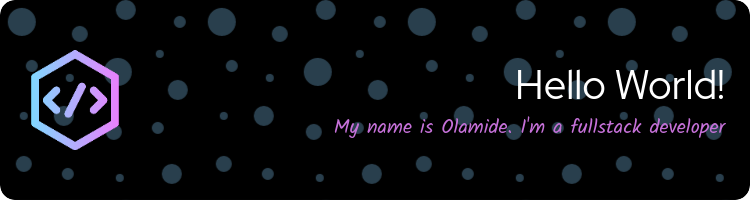

 

    

### **This is where I drop the building blocks for my mansion 😂**
🔭 &nbsp;I’m working on something cool at the moment.\
🌱 &nbsp;Currently playing around with NestJs.\
💬 &nbsp;You can ask me about anything related to React, javascript, typescript or nodeJs.\
⚡️ &nbsp;Fun Fact: I ❤️ 🐺s && games.

&nbsp;

### 🛠 &nbsp;Tech Stack

&nbsp;
&nbsp;
&nbsp;
\
&nbsp;
&nbsp;
&nbsp;
\
&nbsp;
&nbsp;
&nbsp;
\
&nbsp;
&nbsp;

### 🤝🏻 &nbsp;Connect with Me on
 
<a target="_blank" href="https://www.linkedin.com/in/simon-adepetoye-13265b228"></img></a>
&emsp;
<a target="_blank" href="mailto:simonadepetoye@gmail.com"
></img></a>
&emsp;
<a target="_blank" href="https://www.twitter.com/OlamideDev"></img></a>
&emsp;
<a target="_blank" href=""></img></a>

<!-- 
 -->
<!-- 
 -->

<!-- 

    
    

 -->